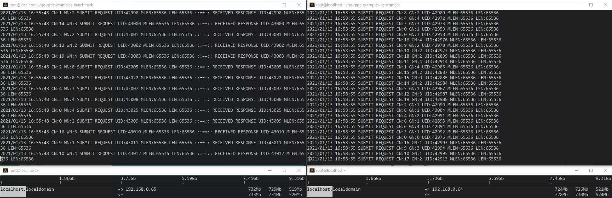

# simple throughput check on real machine using grpc
- using grpc/grpc-go
- https://github.com/grpc/grpc-go

## usage
1. git clone https://github.com/ppzxc/go-grpc-examples-benchmark.git
2. cd go-grpc-examples-benchmark
3. make all
4. echo
```shell
server side
 - ./echo_server -port 9990
 
client side
 - ./echo_client -ip 192.168.0.65 -port 9990 -len 512 -conn 1 -worker 1
```
5. client Stream
```shell
server side
 - ./clientStream_server -port 9990
 
client side
 - ./clientStream_client -ip 192.168.0.65 -port 9990 -len 512 -conn 1 -worker 1 -count 10000
```
6. server Stream
```shell
server side
 - ./serverStream_server -port 9990 -count 1000 -len 512
 
client side
 - ./serverStream_client -ip 192.168.0.65 -port 9990 -conn 1 -worker 1
```
7. bidirectional Stream
```shell
server side
 - ./biStream_server -port 9990
 
client side
 - ./biStream_client -ip 192.168.0.65 -port 9990 -len 512 -conn 1 -worker 1
```
## flags

```protobuf
message Request {
  uint64 uid = 1;
  bytes message = 2;
  int32 len = 3;
  int32 connNumber = 4;
  int32 workerNumber = 5;
}
```

 - ip
 - port
 - len => protobuf bytes message size
 - conn => connection count
 - worker => connection per worker count

## grpc/grpc-go
```
D:\go\go-grpc-examples-benchmark\proto\unary>protoc --version
libprotoc 3.14.0
D:\go\go-grpc-examples-benchmark\proto\unary>protoc --go_out=plugins=grpc:. *.proto
```

## reference
- https://developers.google.com/protocol-buffers/docs/gotutorial
- https://github.com/grpc/grpc-go
- https://github.com/gogo/protobuf
- https://github.com/gogo/grpc-example

## todo
- stream

---------------
---------------
---------------
